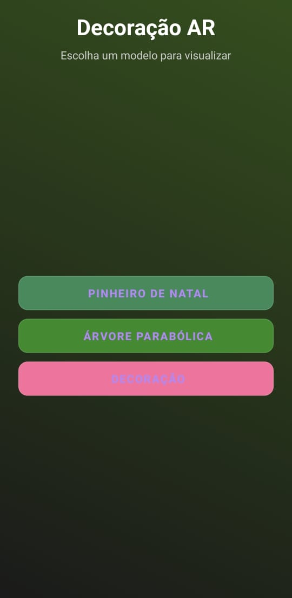

# Decoracao AR - Manual de Execução

## Imagem da Aplicacao

<div align="center">
  
</div>
---

## O que é Decoracao AR

Decoracao AR é uma aplicação de Realidade Aumentada (AR) desenvolvida em Android que permite visualizar modelos 3D em tempo real sobre superfícies do mundo real. O usuário pode selecionar diferentes modelos (Pinheiro de Natal, Árvore Parabólica ou Decoração) e posicioná-los em planos detectados pela câmera do dispositivo.

---

## Requisitos do Sistema

### Hardware Necessário

- Dispositivo Android com suporte a ARCore
- Câmera traseira funcional
- Mínimo 2GB de RAM (recomendado 4GB ou mais)
- Android 7.0 (API 24) ou superior

### Software Necessário

- Android Studio Dolphin ou superior
- JDK 17 ou superior
- Android SDK compileSdk 36 (Android 15)

---

## Instalação e Configuração

### Passo 1: Clonar ou Baixar o Projeto

Clone o repositório do projeto ou baixe os arquivos em uma pasta local:

```bash
git clone <seu-repositorio>
cd decoracao
```

### Passo 2: Abrir no Android Studio

1. Abra o Android Studio
2. Clique em "File" > "Open"
3. Navegue até a pasta do projeto e selecione-a
4. Aguarde o Android Studio sincronizar os arquivos


### Passo 3: Sincronizar o Gradle

1. No Android Studio, clique em "File" > "Sync Now"
2. Aguarde a sincronização completar
3. Se houver erros, verifique se o JDK 17 está configurado corretamente

---

## Executar a Aplicação
### PULE PARA MÉTEDO 2 PARA TESTAR NO CELULAR
### Método 1: Emulador Android

1. Abra o Android Virtual Device (AVD) Manager:
    - Clique em "Tools" > "Device Manager"
2. Crie um novo emulador com:
    - Android 7.0 (API 24) ou superior
    - Google Play Store ativado (para ARCore)
3. Inicie o emulador
4. No Android Studio, selecione o emulador na barra de ferramentas
5. Clique no botão "Run" (ícone de play verde)

### Método 2: Dispositivo Físico

1. Ative o Modo de Desenvolvedor no seu Android:
    - Vá para "Configurações" > "Sobre o Telefone"
    - Toque 7 vezes em "Número da Compilação"
2. Ative a Depuração USB:
    - Vá para "Configurações" > "Opções do Desenvolvedor"
    - Ative "Depuração USB"
3. Conecte o dispositivo ao computador via USB
4. No Android Studio, o dispositivo aparecerá na barra de ferramentas
5. Selecione o dispositivo e clique em "Run"

---

## Como Usar a Aplicação

### Tela Inicial (Menu)

Ao abrir a aplicação, você verá três botões:

1. **Pinheiro de Natal** - Visualiza um pinheiro decorativo
2. **Árvore Parabólica** - Visualiza uma árvore com forma parabólica
3. **Decoração** - Visualiza um modelo decorativo

Clique em um dos botões para iniciar a experiência em AR.

### Tela de Realidade Aumentada

Após selecionar um modelo:

#### Fase 1: Rastreamento

- A câmera começará a escanear o ambiente
- Mensagem: "Movimente o celular para rastrear o ambiente"
- Mova o dispositivo devagar de um lado para o outro
- Aguarde a detecção de superfícies (chão, mesa, paredes)

#### Fase 2: Detecção de Plano

- Planos serão mostrados como grades translúcidas
- Mensagem: "Procurando superfície (boa luz ajuda)"
- Aponte a câmera para um chão ou mesa bem iluminado
- O modelo começará a aparecer quando um plano for detectado

#### Fase 3: Fixação

- Quando um plano for detectado, o modelo será fixado automaticamente
- Mensagem: "Fixado no plano! Deslize para rotacionar"
- As grades dos planos desaparecerão

### Rotacionar o Modelo

Após o modelo ser fixado:

1. Deslize o dedo horizontalmente na tela
2. Deslize para a esquerda para rotacionar no sentido anti-horário
3. Deslize para a direita para rotacionar no sentido horário
4. A rotação é contínua enquanto você desliza

### Fallback Automático

Se nenhum plano for detectado após 4 segundos:

- O modelo aparecerá a 1 metro à frente da câmera
- Mensagem: "Modelo exibido (procurando plano)"
- Você pode continuar procurando por um plano para fixar o modelo

---

## Dicas de Uso

### Para Melhor Deteccao de Planos

- Use ambientes com boa iluminação natural ou artificial
- Evite superfícies muito escuras ou reflexivas
- Aponte para superfícies com textura (carpetes, madeira, azulejos)
- Mova o dispositivo lentamente para melhor rastreamento
- Mantenha a câmera bem posicionada

### Otimizacao de Performance

- Feche outros aplicativos antes de usar
- Garanta que a câmera está limpa
- Use dispositivos com pelo menos 4GB de RAM para melhor performance
- Mantenha o dispositivo em local bem ventilado para evitar superaquecimento

---

## Resolucao de Problemas

### Problema: Aplicacao nao inicia

**Solucao:**
- Verifique se o Android SDK está instalado corretamente
- Sincronize o projeto novamente (File > Sync Now)
- Limpe o cache (Build > Clean Project)
- Reconstrua o projeto (Build > Rebuild Project)

### Problema: Modelos 3D nao aparecem

**Solucao:**
- Verifique se os arquivos GLB estão em `app/src/main/assets/models/`
- Certifique-se de que os nomes dos arquivos estão corretos (case-sensitive)
- Reconstrua o projeto

### Problema: Câmera não funciona

**Solucao:**
- Verifique as permissões (Configurações > Aplicativos > Decoracao AR > Permissões)
- Garanta que a permissão de câmera foi aceita
- Reinicie o aplicativo
- Reinicie o dispositivo

### Problema: Planos nao sao detectados

**Solucao:**
- Melhore a iluminação do ambiente
- Mova-se mais devagar
- Aponte para superfícies com textura
- Aguarde mais tempo (até 4 segundos)
- Verifique se o ARCore está instalado no dispositivo

### Problema: Aplicacao congela ou trava

**Solucao:**
- Feche outros aplicativos
- Limpe a memória do dispositivo
- Verifique a temperatura do dispositivo
- Redimencione a janela da câmera
- Reinicie a aplicação

---

## Estrutura do Projeto

```
decoracao/
├── app/
│   ├── src/
│   │   ├── main/
│   │   │   ├── assets/
│   │   │   │   └── models/
│   │   │   │       ├── pinheiro_de_natal.glb
│   │   │   │       ├── arvore_parabolica.glb
│   │   │   │       └── decoracao.glb
│   │   │   ├── java/
│   │   │   │   └── com/example/decoracao/
│   │   │   │       ├── MainActivity.kt
│   │   │   │       └── MenuActivity.kt
│   │   │   ├── res/
│   │   │   │   ├── layout/
│   │   │   │   │   ├── activity_main.xml
│   │   │   │   │   └── activity_menu.xml
│   │   │   │   ├── values/
│   │   │   │   │   └── colors.xml
│   │   │   │   └── drawable/
│   │   │   │       └── gradient_background.xml
│   │   │   └── AndroidManifest.xml
│   │   └── ...
│   ├── build.gradle.kts
│   └── proguard-rules.pro
├── build.gradle.kts
├── settings.gradle.kts
└── gradle/


```

---

## Tecnologias Utilizadas

- **Linguagem:** Kotlin
- **Framework AR:** Google ARCore
- **Biblioteca 3D:** SceneView
- **IDE:** Android Studio
- **Build System:** Gradle
- **SDK Mínimo:** Android 7.0 (API 24)
- **SDK Alvo:** Android 15 (API 36)

---

## Permissoes Necessarias

A aplicação utiliza as seguintes permissões:

- `android.permission.CAMERA` - Acesso à câmera do dispositivo
- `android.hardware.camera` - Hardware de câmera
- `android.hardware.camera.ar` - Suporte a ARCore

Todas estas permissões são declaradas no arquivo `AndroidManifest.xml` e solicitadas ao usuário na primeira execução.

---

## Contato e Suporte

Para problemas técnicos ou dúvidas:

1. Verifique a documentação do ARCore: https://developers.google.com/ar
2. Verifique a documentação do SceneView: https://github.com/SceneView/sceneview-android
3. Consulte a documentação do Android Studio: https://developer.android.com/studio


---

**Versao da Aplicacao:** 1.0

**Ultima Atualizacao:** Janeiro de 2026
